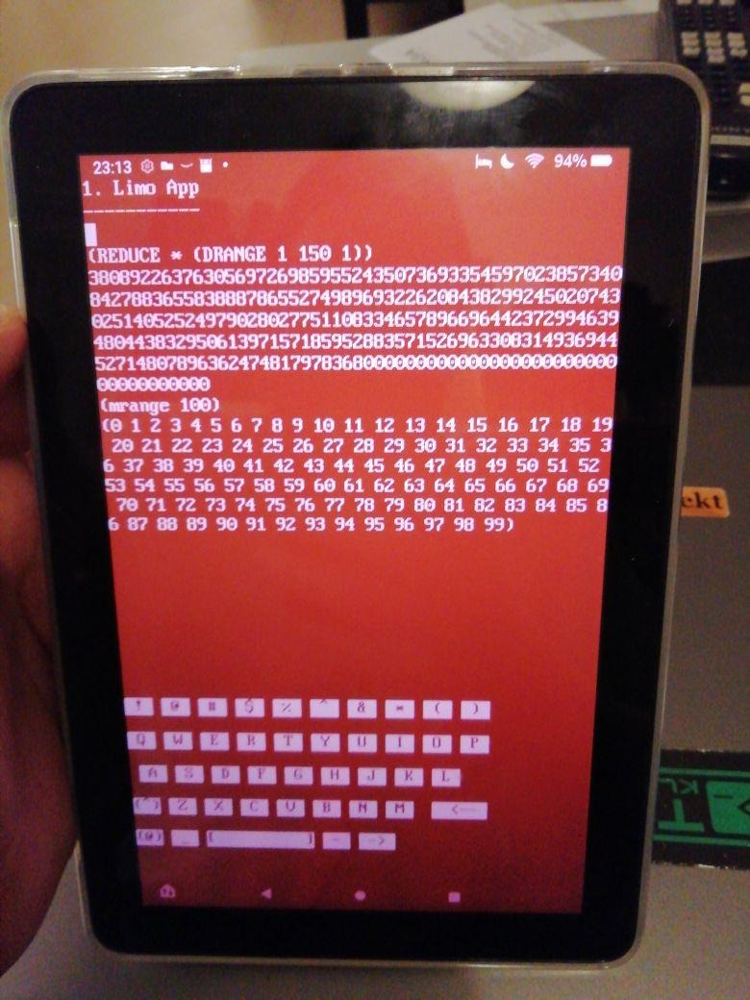

Limo on Android
===============
First barebones try on getting limo to run on android. Most of this will be not done "correctly", I just kicked it until it compiled and ran.

This is built on "Native Activity" from the Android-NDK examples.

Pre-requisites
--------------
- Android Studio 2.2+ with [NDK](https://developer.android.com/ndk/) bundle. (this dependency stems from the "NativeActivity"-NDK-example.
- Limo (installed on your UN*X, you will need it.)

Getting Started
---------------

1. clone this somewhere. 
2. `cd app/src/main/cpp/`
3. fetch and patch some dependencies: `bash buildtool.sh prep_deps`
4. create a `_program.h` from your `program.limo` by typing `bash make_program.sh`. `program.limo`. This is the limo-program which will be executed on apps launch.
5. go back up again `cd ../../../..`
6. Import the directory into Android Studio or just try `bash gradlew build`

Screenshots
-----------

Attributions
------------
- Android NDK: The "NativeActivity"-Example
- I stole the Font from [Dosbox](https://www.dosbox.com/)

License
-------
I release my code under GPLv2. Which can be read under this address
https://www.gnu.org/licenses/old-licenses/gpl-2.0.de.html
